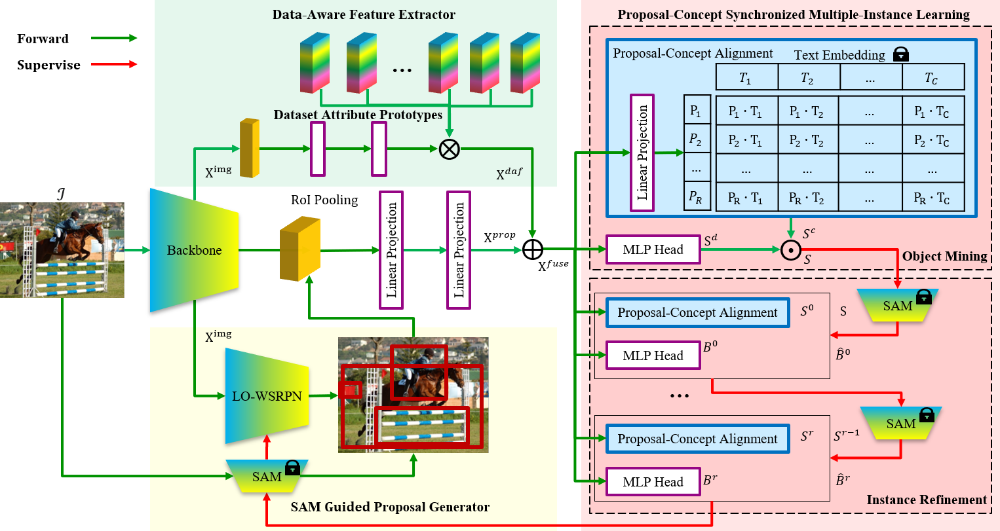

# Weakly Supervised Open-Vocabulary Object Detection
This is an official implementation for AAAI2024 paper "Weakly Supervised Open-Vocabulary Object Detection". (Code is coming soon!)

## 📋 Table of content
 1. [📎 Paper Link](#1)
 2. [💡 Abstract](#2)
 3. [📖 Method](#3)
 4. [🛠️ Install](#4)
 5. [✏️ Usage](#5)
    1. [Start](#51)
    2. [Prepare Datasets](#52)
    3. [Training](#53)
    4. [Inference](#54)
 6. [🔍 Citation](#6)
 7. [❤️ Acknowledgement](#7)

## 📎 Paper Link <a name="1"></a> 
[Read our arXiv Paper](https://arxiv.org/abs/2312.12437)

## 💡 Abstract <a name="2"></a> 
Despite weakly supervised object detection (WSOD) being a promising step toward evading strong instance-level annotations, its capability is confined to closed-set categories within a single training dataset. In this paper, we propose a novel weakly supervised open-vocabulary object detection framework, namely WSOVOD, to extend traditional WSOD to detect novel concepts and utilize diverse datasets with only image-level annotations. To achieve this, we explore three vital strategies, including dataset-level feature adaptation, image-level salient object localization, and region-level vision-language alignment. First, we perform data-aware feature extraction to produce an input-conditional coefficient, which is leveraged into dataset attribute prototypes to identify dataset bias and help achieve cross-dataset generalization. Second, a customized location-oriented weakly supervised region proposal network is proposed to utilize high-level semantic layouts from the category-agnostic segment anything model to distinguish object boundaries. Lastly, we introduce a proposal-concept synchronized multiple-instance network, i.e., object mining and refinement with visual-semantic alignment, to discover objects matched to the text embeddings of concepts. Extensive experiments on Pascal VOC and MS COCO demonstrate that the proposed WSOVOD achieves new state-of-the-art compared with previous WSOD methods in both close-set object localization and detection tasks. Meanwhile, WSOVOD enables cross-dataset and open-vocabulary learning to achieve on-par or even better performance than well-established fully-supervised open-vocabulary object detection (FSOVOD).

## 📖 Method <a name="3"></a> 

The overall of our **WSOVOD**. 
<p align="center">

</p>

## 🛠️ Install <a name="4"></a> 
```
conda create --name wsovod python=3.9
conda activate wsovod
pip install torch==1.12.1+cu113 torchvision==0.13.1+cu113 torchaudio==0.12.1 --extra-index-url https://download.pytorch.org/whl/cu113
pip install -r requirements.txt
pip install -e .
```

## ✏️ Usage <a name="5"></a> 
1、Please follow [this](datasets/README.md) to prepare datasets for training.

2、Download SAM checkpoints.
```
mkdir tools/sam_checkpoints & cd tools/sam_checkpoints
wget https://dl.fbaipublicfiles.com/segment_anything/sam_vit_h_4b8939.pth
wget https://dl.fbaipublicfiles.com/segment_anything/sam_vit_l_0b3195.pth
wget https://dl.fbaipublicfiles.com/segment_anything/sam_vit_b_01ec64.pth
```

3、Prepare SAM proposals for WSOVOD, take voc_2007_train for example.
```
bash scripts/generate_sam_proposals_cuda.sh 4 --checkpoint tools/sam_checkpoints/sam_vit_h_4b8939.pth --model-type vit_h --points-per-side 32 --pred-iou-thresh 0.86 --stability-score-thresh 0.92 --crop-n-layers 1 --crop-n-points-downscale-factor 2 --min-mask-region-area 20.0 --dataset-name voc_2007_train --output datasets/proposals/sam_voc_2007_train_d2.pkl
```

4、Prepare class text embeddings for WSOVOD, take COCO for example.
```
python tools/generate_class_text_embedding_cuda.py --dataset-name coco_2017_val --mode-type ViT-L/14/32 --prompt-type single --output models/coco_text_embedding_single_prompt.pkl
```

5、Download backbone pretrained from [here](https://1drv.ms/f/s!Am1oWgo9554dgRQ8RE1SRGvK7HW2).

6、Train a single dataset and test on another dataset, take COCO and VOC for example.
```
bash scripts/train_script.sh tools/train_net.py configs/COCO-Detection/WSOVOD_WSR_18_DC5_1x.yaml 4 20240301

python tools/train_net.py --config-file configs/PascalVOC-Detection/WSOVOD_WSR_18_DC5_1x.yaml --num-gpus 4 --eval-only MODEL.WEIGHTS output/configs/COCO-Detection/WSOVOD_WSR_50_DC5_1x_20240301/model_final.pth
```
7、Train mix datasets, take COCO and VOC for example.
```

```

## 🔍 Citation <a name="6"></a> 
If you find WSOVOD useful in your research, please consider citing:

```
@InProceedings{WSOVOD_2024_AAAI,
	author = {Lin, Jianghang and Shen, Yunhang and Wang, Bingquan and Lin, Shaohui and Li, Ke and Cao, Liujuan},
	title = {Weakly Supervised Open-Vocabulary Object Detection},
	booktitle = {Proceedings of the AAAI Conference on Artificial Intelligence},
	year = {2024},
}   
```


## License

WSOVOD is released under the [Apache 2.0 license](LICENSE).

## ❤️ Acknowledgement <a name="7"></a> 
-   [UWSOD](https://github.com/shenyunhang/UWSOD)
-   [detectron2](https://github.com/facebookresearch/detectron2)
